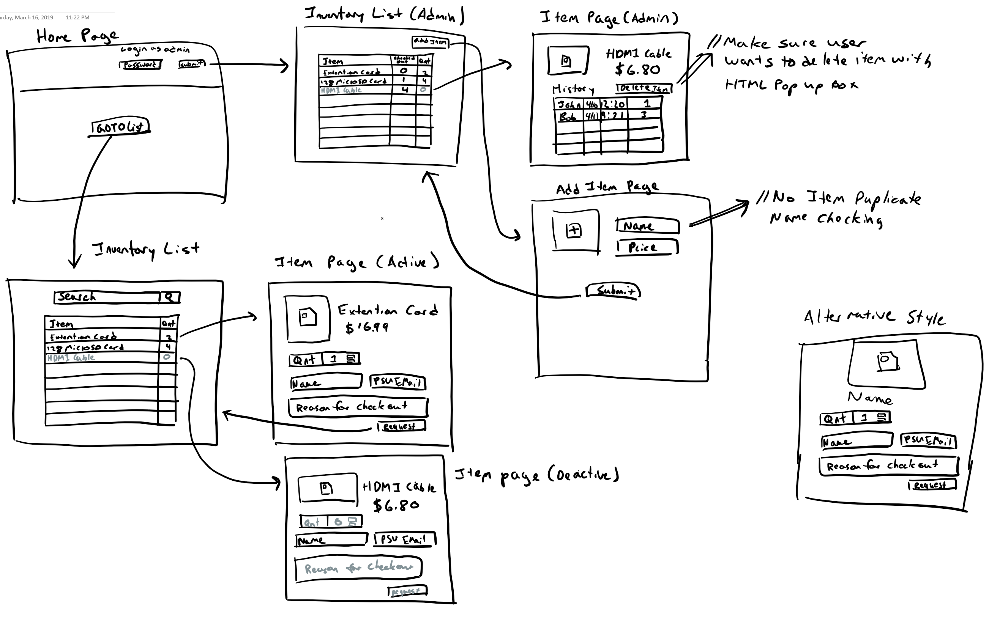

# inventory-manager
Uses Express and Node with MYSQL as the database



Production Server Information:
local ip: 192.168.1.149
server runs on: http://192.168.1.149:3000
user: prod
password: hibsrunkpark
home directory: /home/prod


How to connect to the production server:
1. Install OpenVPN for Windows [WINDOWS INSTALLER (NSIS)] 
* Or install Tunnelbrick for Mac [Stable] 
2. Get the ovpn file to connect to the server 
3. Import the file by right clicking the openvpn desktop icon and selecting import file.
* Or on mac, just drag the ovpn file to the tunnelbrick logo on the top bar (after opening the program)
4. Connect to the production vpn (select production on the menu bar and click connect)
5. Open your favorite ssh program (windows bash, putty, terminal(mac))
* on the ssh terminal you can type ```ssh prod@192.168.1.149```
6. Enter the password listed above, and login
7. run the server (instructions below)

On the production server, sudo requires no password and the files are located on the CheckSum folder.

Navigate to the checksum folder and run ```node bin/www``` to start the server
```shell
cd ~/CheckSum
node bin/www
```

You can set the server to the background by inserting &:  ```node bin/www &```

Collaborators:
- Eric Wong
- Avi Jain
- Karan Jain
- Boris Liao
- Stanley Tsuei
